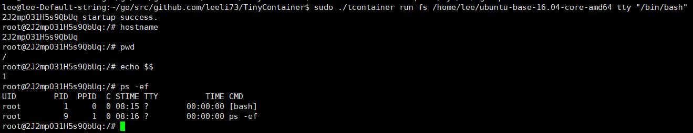

TinyContainer - 超轻量容器
============

TinyContainer是本人拜读《自己动手写Docker》一书后，自己编写的一个超轻量级容器，更严格的说，TinyContainer更像是一个支持CGroups的proot容器。

TinyContainer在此之前运用于本人的通用型分布式计算框架，主要负责计算任务之间的隔离，所以TinyContainer中并没有包含AUFS相关组件，而是将应用镜像和AUFS的管理交给了上层应用。TinyContainer只是包含了简单的容器功能，所以它只包含一个二进制文件。经过UPX压缩后，主程序只有不超过500K的大小(以amd64为例)。

特别要感谢陈显鹭等大佬编写的《自己动手写Docker》一书，让我对Docker、LXC、CGroups、AUFS等有了更加深刻的认识。

当然，因为上层应用的需求不高，TinyContainer也相对简陋，也有很多需要改进的地方，比如它只是简单的重定向了Stdin、Stdout和Stderr，并不支持pty，这也是未来本人想要改进的地方。



上面是TinyContainer的预览效果


参数
====
```
TinyContainer version: beta/1.0.0
Usage Simple Example: tcontainer [run] [-name ContainerName] [-fs ContainerFSroot]

Options:
  run 
	Run Container
  cpuset string
	CPU core that container can use.Unlimited by default.
  cpushare string
	CPU Share that container can use.Unlimited by default.
  fs string
	The path of the Fire System used by the container.Default to use you fsroot. (default "/")
  memlimit string
	Max Memory that container can use.Unlimited by default.
  name string
	The name of container.Default to random string.
  net bool
	Whether to init network.Share your machine.Default to false.
  tty bool
	Whether to start tty.Default to true.
  -help or -h
	Show help information.
```

目前已经完成
============

    常见容器权限的隔离，如PID，UTS，Net等

未来
====

    pty支持

    从Docker hub直接拉取镜像


在自己的项目中集成
==================

准备
----

    go get github.com/leeli73/TinyContainer

demo
----
```
package main

import (
	tc "github.com/leeli73/TinyContainer/container"
)

func main() {
	if len(os.Args) <= 1 {
		fmt.Println("Can't find command.")
		return
	}
	switch os.Args[1] {
	case "run": //初始化容器初始化入口
		container := tc.Container{ //配置相关参数
			Name:          name, 
			FsDir:         fsDir,
			Command:       os.Args[len(os.Args)-1],
			EnableTTY:     enableTTY,
			EnableNetwork: enableNetwork,
			MemoryLimit:   memoryLimit,
			CpuSet:        cpuSet,
			CpuShare:      cpuShare,
		}
		container.Run(parm) //调取库接口初始化容器
	case "child": //定义子进程入口
		if os.Args[0] != "/proc/self/exe" { //判断是否为自身调用
			fmt.Println("This command must run by TinyContainer.")
			return
		}
		container := tc.Container{ //配置相关参数
			Name:          name,
			FsDir:         fsDir,
			Command:       os.Args[len(os.Args)-1],
			EnableTTY:     enableTTY,
			EnableNetwork: enableNetwork,
			MemoryLimit:   memoryLimit,
			CpuSet:        cpuSet,
			CpuShare:      cpuShare,
		}
		container.Child(os.Args[len(os.Args)-1:]) //调取库接口真正启动容器
	default:
		fmt.Println("can't find the main command!")
	}
}
```